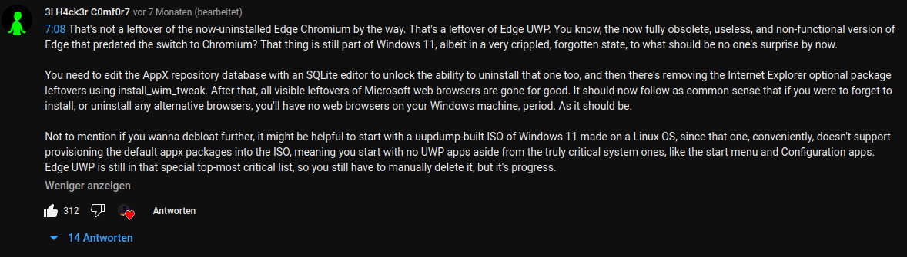

# EF (Edge Fuck)
This is designed for the Microsoft Edge haters to completely wipe MS Edge off their system.
It also includes a background task (no spying on you, I swear), so that no Edge remnants
will be remained on your system. Microsoft might flag this as malicious, but it's not.

***Disclaimer!!** This is not 100% full-proof secure, as Microsoft might ruin Edge removal
process in the future and also might break your system. For the sake of yourself, test it
out in a virtual machine first, then if it succeeds, run it on real hardware. If your Windows
installation gets messed up because of stupid you were running this App, then do not put the
blame on me, because you yourself didn't run it on a virtual machine or on a Windows sandbox.
It is currently in development and in preview mode, so it is not recommended to run it yet,
until the stable version comes out (with an included Application updater). This might also
ruin Windows Search (as it needs the "Edge WebView2"), so please, run it at your own risk.*

I am not planning to integrate Microsoft Edge installation on this tool, if you want to
revert the actions you've made, but that might be considered a feature in the future
versions, but not for the initial stable release.

---

## Setup and run
Are you hyped already to load in this Application onto your System and let it run? Well, not
exactly. You might see the "EdgeFuck.cfg" file, when extracted. Open that editor and modify
it to your likings. As soon as I'll make a Wiki page on modifying it, I'll link it here on
how to modify the configuration file without any expected crashes or anything. You can,
delete the file and the App will load in the default configurations from the Application JAR
Package itself.

After modifying it, you can run the Application "EdgeFuck.exe" and a Command Prompt /
Powershell should fire up with Administrative privileges. It will first check for a browser
(because having a System with Edge only) and prompt you to install one from the recommended
list (Brave, Opera / Opera GX, Google Chrome / Chromium, Firefox). If none of the browsers
are your favorites, you can always hop onto Edge and install a Browser to your likings
manually, with letting the Application cancel the Browser Installation section.

---

## Inspirations + How it works
If you still decided to wonder on how it works, well I give you some explanation onto it.
Me personally, I watch YouTube videos and I decided to get one step further and develop an
app to keep edge off the systems for those people that really don't like the in-built
browser. Some people make videos on how to remove Microsoft Edge, but people don't clearly
want to go through the Registry themselves because we call it "the scary spooky system
configuration tool". Now, I'll explain on how it works:
- Asks you to install another browser, if you don't have one installed yet
- It clearly wipes Edge off, obviously
- Modifies the Registry to remove the Edge entries from Apps & Program lists with additional
 tweaks
- Modifies the AppX repository database via an SQL editor (included)
- Copies the application files over to C:\Windows\EdgeWiper and starts a background service
 watcher

Yeah, for now this is the list. This list might get expanded in the future, as Microsoft
wants Edge to be your primary and the only browser on your system. It is being taken
from those YouTube videos on removing this bloatware of a browser:
- [YouTube Video 1](https://www.youtube.com/watch?v=7TUMk9AzPfE)
- [YouTube Video 2](https://www.youtube.com/watch?v=SC7offaMZ1Q)
- [YouTube Video 3](https://www.youtube.com/watch?v=sh5OekVmbac)

---

## Process
### Edge Removal
I don't need to go over with this, do I? Practically remove all the necessary Edge files from
the system, pretty much clearly. Usually, Edge is installed under
"C:\Program Files (x86)\Microsoft\Edge" (with additional folders, such as "EdgeCore" and so
on), so this will be taken care of. If your Edge installation does not include a directory
called "EdgeWebView" or something like that, your Windows installation might be either
shitting itself or your Windows Search might be broken.

### Registry editing
As people don't like having Registry mentioned because just how easily you can mess something
up, this app tries not to mess up with your system (again, read the disclaimer). For now,
it is known to remove the Application entries to not bother anyone with the "Microsoft Edge"
entry in the Apps list.

### AppX Repository Database editing
For someone Windows tech-savvy, you might be asking "what is AppX?". To be honest, I don't
know myself what that is. I only saw this one comment under the first YouTube video

### Copy over + Background service
Now, as the file copy goes, it will copy over the runnable files (runtime + app) itself.
It will extract the file "EF-Run.exe" to the extraction directory at "C:\Windows\EdgeWiper"
from their JAR files.

Please note that this won't copy over the EF-Console.exe file, which you'll usually
run, but you can make it happen by modifying the configuration file shipped by default.